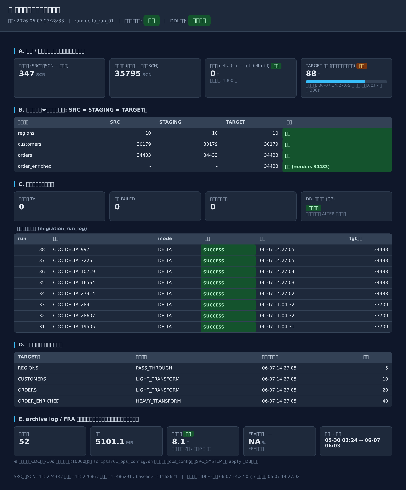

# Oracle データ移行検証環境

Oracle データベース移行を **業務停止なし** で実施するための手順・設計を検証する環境。  
本番は Oracle 12c（約5TB・約500テーブル）、ローカルは Oracle 21c XE コンテナで動作確認を行う。

> **注意**: 本番性能検証には使用しない。構文・構造・ロジックの試作専用。

---

## 移行状況ダッシュボード（ビューア）

<p align="center">
  
</p>

`bash scripts/50_migration_dashboard.sh` で生成される自己完結 HTML（`out/migration_dashboard.html`）を
ブラウザで開いた画面。両 DB（oracle-src / oracle-tgt）を照会し、移行の進み具合をひと目で確認できる。
`scripts/51_dashboard_daemon.sh` で定期再生成すれば自動更新される。

**画面の説明**

- **ヘッダ**: 生成時刻・対象 run 名と、パイプライン健全性（正常／要確認）・DDL 凍結状態のバッジ。
- **A. 遅延 / 鮮度**: 抽出ラグ・適用ラグ（SCN 差）、未搬送 delta 件数、TARGET の鮮度（最終変換からの経過秒）。
  しきい値（`ops_config`）を超えると黄／赤で警告。
- **B. 件数照合（移行判断基準）**: テーブルごとに SRC＝STAGING＝TARGET の件数を突き合わせ、
  一致を緑・不一致を赤で表示。**移行完了の主判断基準**。
- **C. パイプライン健全性**: 適用失敗 Tx・台帳 FAILED・変換エラー件数・DDL 凍結違反、直近の変換実行履歴。
- **D. テーブル別 変換カタログ**: 各 TARGET 表の変換分類（PASS_THROUGH／LIGHT／HEAVY）と最終変換時刻。
- **E. archive log / FRA 保持リスク**: 差分が読める期間（保持本数・総量・保持日数）と FRA 使用率。
  枯渇リスクをしきい値で警告（運用値は `scripts/61_ops_config.sh` で変更可）。

> 上図は、稼働中アプリを模した data-generator で継続的に DML を流したのち CDC を排出させ、
> SRC＝STAGING＝TARGET が完全一致（B が全行「一致」）した健全状態のスナップショット。

---

## 背景・制約

| 項目 | 内容 |
|------|------|
| 移行元 | Oracle 12c（レガシー環境） |
| 移行先 | 新 Oracle DB（別拠点） |
| データ量 | 約 5TB / 約 500 テーブル |
| ネットワーク | オフライン環境（インターネット不可） |
| DB リンク | 利用困難 |
| GoldenGate | 利用不可 |
| スキーマ変換 | 必要（複数テーブルの統合など複雑な変換あり） |
| 業務停止 | 極力回避 |

---

## 採用した移行方式

### 全体フロー

```
[移行元 Oracle 12c]
   │
   ├─ Step 1: 基準 SCN 取得
   ├─ Step 2: DataPump expdp（FLASHBACK_SCN 指定）→ ダンプファイル生成
   ├─ Step 3: ダンプファイルをオフライン搬送（SSD/NAS）
   │
[移行先 Oracle]
   ├─ Step 4: DataPump impdp → STAGING_SCHEMA（移行元と同一構造）
   ├─ Step 5: 差分抽出ループ（移行元で LogMiner → delta_queue）
   ├─ Step 6: delta_queue を DataPump でファイル化 → 搬送 → 移行先にロード
   ├─ Step 7: STAGING_SCHEMA に差分適用（SYS.delta_apply）
   ├─ Step 8: PL/SQL 変換（STAGING_SCHEMA → TARGET_SCHEMA）
   └─ Step 9: カットオーバー（接続先切替）
```

### 差分同期の設計方針

**移行元で LogMiner 解析 → 結果 SQL だけを搬送**

```
oracle-src: SYS.delta_extract（LogMiner / DICT_FROM_ONLINE_CATALOG）
   → cdc_schema.delta_queue に INSERT/UPDATE/DELETE を格納
      → expdp でダンプファイル化
         → 物理搬送（検証環境では docker cp）
            → oracle-tgt: impdp → staging_ctl.delta_queue
               → SYS.delta_apply（SRC→STAGING 置換して EXECUTE IMMEDIATE）
                  → STAGING_SCHEMA に差分反映
```

> **なぜ移行先で LogMiner しないのか**  
> `DBMS_LOGMNR_D.BUILD` の flat-file 辞書は PDB スキーマを含まないため、  
> 移行先で archive log を読んでも変更を 0 件と認識する。  
> スキーマ定義がある移行元で解析し、翻訳済み SQL を搬送するのが正しい設計。

詳細: `docs/migration-strategy.md` / `docs/delta-extract-design.md`

---

## 前提条件

| 項目 | 要件 |
|------|------|
| OS | Windows 11 + WSL2 (Ubuntu) |
| Docker Desktop | WSL2 integration 有効 |
| Oracle アカウント | container-registry.oracle.com へのアクセス権 |
| メモリ | WSL2 に 4GB 以上割り当て推奨 |

---

## コンテナ構成

```
┌─────────────────────────────────────────────────────────────────┐
│ Docker Network: cdc-migration-net                               │
│                                                                 │
│  ┌──────────────────┐              ┌──────────────────┐        │
│  │  oracle-src      │  差分SQL搬送  │  oracle-tgt      │        │
│  │  Oracle 21c XE   │ ───────────▶ │  Oracle 21c XE   │        │
│  │  port: 1521      │  （ファイル）  │  port: 1522      │        │
│  │                  │              │                  │        │
│  │  SRC_SCHEMA      │              │  STAGING_SCHEMA  │        │
│  │  CDC_SCHEMA      │              │  STAGING_CTL     │        │
│  │  LOG_SCHEMA      │              │  TARGET_SCHEMA   │        │
│  └──────────────────┘              └──────────────────┘        │
│         ▲                                                       │
│         │ DML 発行                                              │
│  ┌──────────────┐                                               │
│  │ data-generator│  Python コンテナ（停止中）                    │
│  │ LOW/MED/HIGH  │  稼働中 DB をシミュレーション                  │
│  └──────────────┘                                               │
└─────────────────────────────────────────────────────────────────┘
```

| コンテナ | 役割 |
|---------|------|
| `oracle-src` | 移行元 DB を模擬。LogMiner での差分抽出元 |
| `oracle-tgt` | 移行先 DB を模擬。STAGING→TARGET の変換先 |
| `data-generator` | 稼働中アプリを模擬。LOW 強度で SRC_SCHEMA に DML を継続発行 |

---

## 初回セットアップ

### ⚡ クイックスタート（推奨：ほぼ自動）

別マシン（社内 WSL2 等）への移植は **`git clone` してスクリプト1回**で完了する。
IT 初心者向けの詳細な手順は [`SETUP_GUIDE.md`](SETUP_GUIDE.md) を参照。

```bash
# 取得して構築（コンテナ起動 + 両DBのスキーマ/パッケージ/設定を自動デプロイ）
git clone <repo-url> && cd data-transfer
./setup.sh            # 標準構築（10〜15分）
# ./setup.sh --full   # 初期ロード + CDC/ダッシュボード常駐まで自動
# ./setup.sh --plan   # 何をするか確認だけ（実行しない）
```

`setup.sh` が自動で行うこと：前提確認 → `.env` 自動生成 → コンテナ起動・healthy 待機 →
**正しい順序での全SQLデプロイ**（src: 10→11→13→14→30→31→34→35 / tgt: 20→32→40→41→42→33）→
data-generator 起動。手作業は実質 `git clone` のみ。

> **Oracle のログインは原則不要**（21c XE イメージは匿名 pull 可能。検証済み）。
> 稀に取得できない環境でのみ `docker login container-registry.oracle.com` を実行してから再実行する。

---

### 手動セットアップ（仕組みを理解したい場合）

<details>
<summary>クリックして展開</summary>

#### 1. Oracle Container Registry にログイン（原則不要・取得できない場合のみ）
21c XE イメージは匿名 pull 可能なため通常は不要。取得に失敗する環境でのみ実施:
```bash
docker login container-registry.oracle.com
```
[Oracle Container Registry](https://container-registry.oracle.com) で利用規約に同意しておくこと。

#### 2. 環境変数ファイルの作成
```bash
cp .env.example .env   # 必要ならパスワードを編集
```

#### 3. コンテナ起動
```bash
docker compose up -d
docker compose ps   # 全コンテナが healthy になるまで待つ（3〜5 分）
```

#### 4. oracle-src のスキーマ構築（順序が重要）
```
sql/cdc/10_cdc_create_users.sql        ユーザー作成（&&パスワードは .env 値を DEFINE）
sql/cdc/11_cdc_src_schema.sql          SRC_SCHEMA DDL
sql/cdc/13_cdc_schema.sql              CDC_SCHEMA DDL
sql/cdc/14_supplemental_logging.sql    ARCHIVELOG + 補足ログ（DB再起動を伴う）
sql/cdc/30_delta_queue_src.sql         delta_queue
sql/cdc/31_pkg_delta_extract_src.sql   SYS.delta_extract
sql/cdc/34_cdc_table_catalog.sql       追跡対象カタログ
sql/cdc/35_ops_config_src.sql          運用パラメータ ops_config
```

#### 5. oracle-tgt のスキーマ構築（順序が重要）
```
sql/cdc/20_staging_users_tgt.sql       STAGING_SCHEMA ユーザー
sql/cdc/32_delta_queue_tgt.sql         staging_ctl + delta_queue + apply_ledger
sql/transform/40_phase2_setup_tgt.sql  TARGET/LOG ユーザー + 各表 + 変換カタログ
sql/transform/41_pkg_transform_util.sql 共有変換関数
sql/transform/42_pkg_transform.sql     変換オーケストレータ
sql/cdc/33_pkg_delta_apply_tgt.sql     SYS.delta_apply
```

各ファイルは `CONNECT / AS SYSDBA` を内蔵。`docker exec -i -u oracle <container> sqlplus -S /nolog < file`
で流し込める（`&&` 置換変数を使うファイルは事前に `DEFINE` が必要 → `setup.sh` が自動注入）。
</details>

---

## 差分同期の実行手順

### 1. 差分を抽出（oracle-src で実行）

```sql
-- oracle-src の sqlplus（/ as sysdba）で実行
SET SERVEROUTPUT ON SIZE UNLIMITED
BEGIN SYS.delta_extract('delta_run_01'); END;
/
-- 出力例: delta_extract: extracted=4 rows, scn=[10723219,10723505]
```

### 2. 差分を搬送して適用（ホスト側で実行）

```bash
bash scripts/06_transfer_delta_datapump.sh
```

このスクリプトが以下を一括実行する:
1. oracle-src: `expdp` で `delta_queue` をダンプファイル化
2. ダンプファイルを docker cp で搬送（本番では SSD/NAS）
3. oracle-tgt: `impdp` で `staging_ctl.delta_queue` にロード
4. oracle-tgt: `SYS.delta_apply` で `STAGING_SCHEMA` に適用

### 3. 適用結果の確認

```sql
-- oracle-tgt の sqlplus（/ as sysdba）で実行
ALTER SESSION SET CONTAINER = XEPDB1;

-- 適用済み差分の確認
SELECT delta_id, operation,
       CASE WHEN applied_at IS NULL THEN 'NOT APPLIED' ELSE 'APPLIED' END AS status
FROM staging_ctl.delta_queue ORDER BY delta_id;

-- STAGING_SCHEMA の件数確認
SELECT table_name, num_rows FROM dba_tables WHERE owner='STAGING_SCHEMA';
```

---

## ディレクトリ構成

```
data-transfer/
├── .claude/agents/            サブエージェント定義
├── docs/
│   ├── migration-strategy.md  本番移行方式の全体設計書（主要ドキュメント）
│   ├── delta-extract-design.md 差分抽出・適用方式の詳細設計
│   ├── cdc-verification-design.md CDC検証フェーズの設計（初期版）
│   ├── environment-design.md  コンテナ構成設計
│   ├── migration-design.md    スキーマ変換移行設計（フェーズ1）
│   ├── logging-and-error-handling.md ログ設計
│   └── oracle-compatibility-policy.md Oracle 12c 互換ポリシー
├── sql/
│   ├── 00〜05_*.sql           フェーズ1: スキーマ変換移行（同一DB内）
│   └── cdc/
│       ├── 10〜18_*.sql       CDCフェーズ（DBリンク方式・参考実装）
│       ├── 20_staging_users_tgt.sql   STAGING_SCHEMA ユーザー作成
│       ├── 22_logminer_on_tgt.sql     （調査用: 移行先LogMiner ※制約あり）
│       ├── 30_delta_queue_src.sql     ★ oracle-src: delta_queue テーブル
│       ├── 31_pkg_delta_extract_src.sql ★ SYS.delta_extract プロシージャ
│       ├── 32_delta_queue_tgt.sql     ★ oracle-tgt: staging_ctl + delta_queue
│       └── 33_pkg_delta_apply_tgt.sql ★ SYS.delta_apply プロシージャ
├── scripts/
│   ├── 01_datapump_export.sh  DataPump エクスポート（初期同期用）
│   ├── 02_transfer_dumps.sh   ダンプファイル搬送
│   ├── 03_datapump_import.sh  DataPump インポート（初期同期用）
│   ├── 04_sync_archivelogs.sh archive log 同期（調査用）
│   ├── 05_apply_delta_on_tgt.sh （調査用: 移行先LogMiner）
│   └── 06_transfer_delta_datapump.sh ★ 差分搬送パイプライン（メイン）
├── data-generator/            稼働中アプリシミュレーター（Python）
│   ├── generator.py           メインループ
│   ├── workload/              DML ワークロード定義
│   └── init/seed_master.py    初期マスタデータ投入
├── docker-compose.yml
├── .env.example
└── README.md
```

★ = 現在の主要実装ファイル

---

## 設計上の重要な発見（ハマりどころ）

本検証で判明した実装上の注意点。本番適用時に留意すること。

| # | 現象 | 原因 | 対策 |
|---|------|------|------|
| 1 | LogMiner が変更を 0 件と報告 | `DICT_FROM_ONLINE_CATALOG` 使用時、PDB の変更は `CON_ID=1(CDB$ROOT)` として報告される | `CON_ID` フィルタを使わず `SEG_OWNER` のみで絞る |
| 2 | 適用時 `ORA-00933` | LogMiner の `SQL_REDO` は末尾にセミコロンが付く。`EXECUTE IMMEDIATE` は不可 | 末尾セミコロンを除去してから適用 |
| 3 | `impdp` が `ORA-31640` | `docker cp` したファイルが UID1000 所有で oracle ユーザーが読めない | ホスト側で `chmod 644` してから配置 |
| 4 | `DATA_PUMP_DIR` のパスが見つからない | PDB では GUID サブディレクトリ配下にダンプが格納される | `find` で実パスを動的解決 |
| 5 | LOB が `EMPTY_CLOB()` になる | out-of-line LOB は redo にインライン化されない | `FLASHBACK QUERY` フォールバックが必要（未実装） |
| 6 | `DBMS_LOGMNR_D.BUILD` が PDB スキーマを含まない | `CDB$ROOT` からの flat-file 辞書は PDB オブジェクトを含まない。PDB から実行すると `ORA-65040` | **解析は移行元で行い、結果 SQL を搬送**する設計に変更 |
| 7 | Archive log が消滅（10日後） | XE では保持期間が短い | CDC 停止中も archive log の保持設定を確認・運用すること |
| 8 | フレッシュ環境で `impdp` が `ORA-31640`（搬送ダンプを開けない） | 新規コンテナでは `DATA_PUMP_DIR` の GUID サブディレクトリが Data Pump 初回実行まで物理的に存在せず、`ls -d */` 推測が空を返してベースディレクトリへ誤配置する | tgt の `DATA_PUMP_DIR` 実パスを `DBA_DIRECTORIES` から取得し `mkdir -p` してから配置（scripts/06・30 で対応済み） |
| 9 | TARGET に変換結果が一部欠落（件数が STAGING に満たない） | transform DELTA の差分窓が「ソース業務時刻 `updated_at/created_at`」、watermark が「tgt 壁時計」で時間軸不一致。パイプライン遅延・障害で「ソース時刻 < watermark」の行が永久に窓外となり静かに欠落 | STAGING に `synced_at`(tgt適用時刻) 列＋トリガを追加し、差分窓を `synced_at` で切る（watermark と同一時間軸）。scripts と sql/transform/40・42 で対応済み |

---

## 残課題（フェーズ2）

- [ ] STAGING_SCHEMA 初期同期（DataPump 全量エクスポート/インポート）
- [ ] 全 10 テーブルへの差分抽出拡張（現在は SYSTEM_EVENTS のみ）
- [ ] FK 依存順適用（INSERT: 親→子 / DELETE: 子→親）
- [ ] LOB フォールバック実装（FLASHBACK QUERY）
- [ ] TARGET_SCHEMA（新構造）の DDL 設計と PL/SQL 変換パッケージ
- [ ] archive log 生成量計測・保持ポリシー設定

---

## トラブルシューティング

### コンテナが healthy にならない

```bash
docker compose logs oracle-src | tail -50
```

- メモリ不足: Docker Desktop の割り当てを 4GB 以上に増やす
- ポート競合: `netstat -tlnp | grep 1521` で確認

### 差分抽出で 0 件が返る

```sql
-- oracle-src CDB$ROOT で直接確認
EXEC DBMS_LOGMNR.ADD_LOGFILE('...', DBMS_LOGMNR.ADDFILE);
EXEC DBMS_LOGMNR.START_LOGMNR(STARTSCN => :scn, OPTIONS => DBMS_LOGMNR.DICT_FROM_ONLINE_CATALOG);
SELECT con_id, seg_owner, seg_name, operation FROM V$LOGMNR_CONTENTS WHERE SEG_OWNER='SRC_SCHEMA';
-- CON_ID=1 で返ってくる点に注意（CON_ID=3 ではない）
```

### delta_apply が `ORA-00933` で失敗する

```sql
-- SQL_REDO の末尾を確認
SELECT SUBSTR(sql_redo, -5) FROM staging_ctl.delta_queue WHERE delta_id=:id;
-- セミコロンが付いている場合は 33_pkg_delta_apply_tgt.sql を再デプロイ
```

### Archive log が消えて CDC が再開できない

```sql
-- 利用可能な最古の archive log を確認
SELECT MIN(first_change#), TO_CHAR(MIN(first_time),'YYYY-MM-DD HH24:MI') AS oldest
FROM v$archived_log WHERE deleted='NO' AND standby_dest='NO';
```

archive log が必要 SCN より古い場合は再スナップショット（初期同期からやり直し）が必要。
