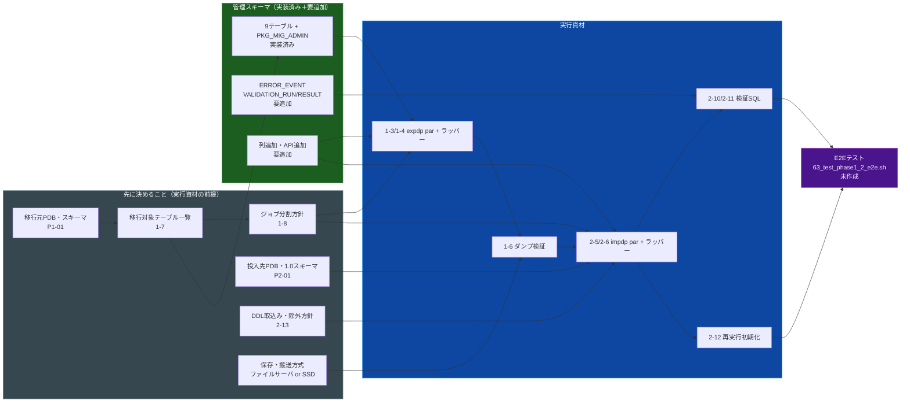
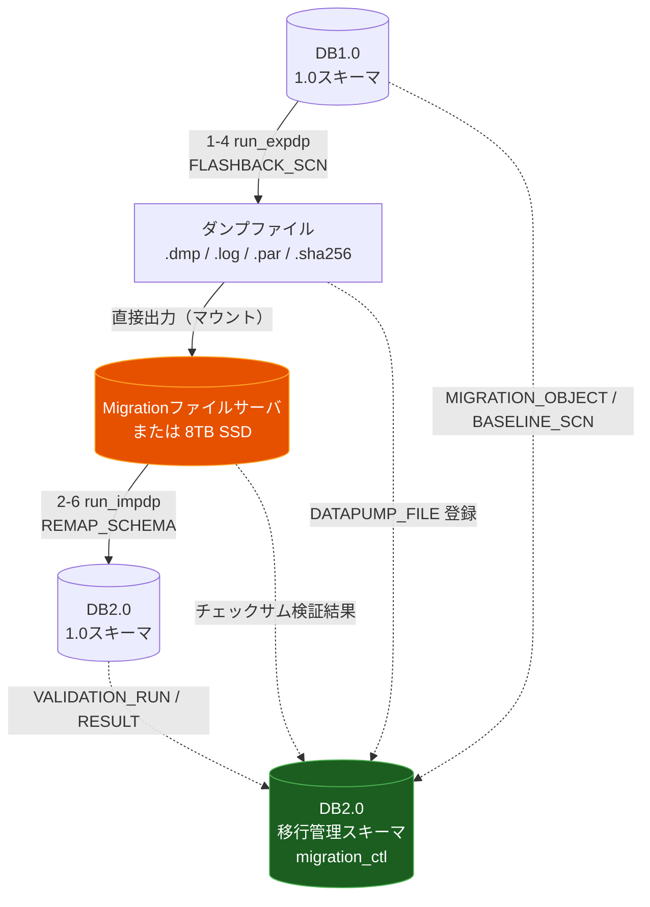

# フェーズ1・2（初回全量 Export / Import）成果物一覧とプロセスフロー

作成日: 2026-07-27
対象: 新設計「5フェーズ・移行管理テーブル連携反映版」のフェーズ1・2
目的: フェーズ1・2の検証を実施するために**何が必要で、何が既にあり、何が足りないか**を確定し、
成果物どうしの関係をプロセスフローとして可視化する。

---

## 1. 結論（先に3行）

- フェーズ1・2の**実行資材は25点**必要（設計メモ §3.4 / §4.4）。うち**23点完了・2点未着手**（2-13/2-14）
- 管理スキーマの補強は完了。`ERROR_EVENT` / `VALIDATION_RUN` / `VALIDATION_RESULT` の3テーブル追加・
  既存4テーブルへの列追加・8本のAPIをすべて実装し、`sql/migration_ctl/04〜05` として適用済み
- E2Eテスト（`scripts/66_test_phase1_2_e2e.sh`、T01〜T16）を実際のコンテナで実行し、
  全テスト PASS を確認。`COMPLETE_PHASE` 機械判定・部分再実行・AS OF SCN 検証がすべて正常動作した

---

## 1.5 仮決定事項（2026-07-27）

本番要件が未確定な項目は、検証を進めるため**仮で決定**した。本番設計時に再判断する。

### 1.5.1 環境から自明な確定事項

| 項目 | 決定 |
|---|---|
| 移行元（DB1.0相当） | `oracle-src` / PDB=`XEPDB1` / スキーマ=`SRC_SCHEMA` |
| 投入先（DB2.0側1.0スキーマ） | `oracle-tgt` / PDB=`XEPDB1` / スキーマ=`STAGING_SCHEMA` |
| 移行管理スキーマ | `oracle-tgt` / PDB=`XEPDB1` / スキーマ=`MIGRATION_CTL`（同一PDB内・DBリンク不使用） |
| 対象テーブル | `REGIONS` / `CUSTOMERS` / `ORDERS` の3表 |

### 1.5.2 相談のうえ仮決定した事項

| # | 論点 | 決定 | 理由 |
|---|---|---|---|
| D-1 | 実行資材の配置・命名 | `sql/phase1/` `sql/phase2/` を新設し、設計メモ §3.4/§4.4 のファイル名をそのまま採用。実行ラッパーは `scripts/63〜66`。既存 `scripts/01〜03` は**旧プロトタイプとして残置**（先頭に非推奨である旨を明記） | メモの資材一覧と1対1で対応し、社内展開時に説明しやすい |
| D-2 | Data Pump ジョブ分割 | **2ジョブに分割**。`GRP01` = `REGIONS` + `CUSTOMERS`、`GRP02` = `ORDERS`。`MIGRATION_OBJECT.EXPORT_GROUP_CODE` で管理 | 本番は5TB/500表で分割が必須。ジョブ単位の完了判定と**部分再実行**を実際に検証するため |
| D-3 | 搬送層の模擬 | `docker-compose.yml` に named volume `migfs` を追加し、`oracle-src` / `oracle-tgt` の両方に `/migfs` としてマウント。Oracle DIRECTORY オブジェクト `MIG_FS_DIR` を両側に作成し、**expdp は中継領域へ直接出力**、impdp は同領域を直接参照 | 「DB1.0からマウントした領域へ直接出力する」新設計の構成（メモ §5）に最も近い。DIRECTORY・権限の扱いも検証対象に含められる |
| D-4 | 管理スキーマの補強範囲 | **フル補強**。`ERROR_EVENT` / `VALIDATION_RUN` / `VALIDATION_RESULT` の3テーブル追加＋既存4テーブルへの列追加＋API追加（`COMPLETE_PHASE` を含む） | §3.2.5 / §4.2.5 の完了判定をSQLで機械化しないと「フェーズ完了」を宣言できないため |
| D-5 | DDL取込み・除外方針 | 表・主キー・索引は取り込む。**業務トリガーと業務ジョブは再現しない**（メモ §12.1）。索引・制約は Import 時に除外し、`08_rebuild_indexes_constraints.sql` で**取込み後に再構築**する | メモ §12.1 の前提。および資材一覧に 2-8 が存在することから、取込み後再構築が想定されている |

### 1.5.3 この検証環境では再現しない（割り切る）事項

以下は環境の制約により**検証対象から外す**。本番相当環境での確認が別途必要であることを明記して残す。

| 項目 | 理由 | 本番で別途必要なこと |
|---|---|---|
| RAC Thread 別の挙動 | `oracle-src` はシングルインスタンス | Thread別 Sequence 管理・全Thread の網羅確認 |
| 5TB / 500表 規模の実測 | 検証データは数十MB / 3表 | 所要時間・並列度・ファイル分割数・UNDO/TEMP の実測 |
| 8TB SSD 搬送方式の比較PoC | 物理媒体がない | 直接書込み性能・取外し搬送・接続後のチェックサム照合 |
| Oracle 12c / 19c の実バージョン差 | 両側とも 21c XE | 12.1/12.2 差、プラットフォーム互換性 |
| 独立した物理ファイルサーバ | 単一ホスト上の共有ボリュームで代替 | NFS/CIFS マウント方式・ネットワーク帯域・障害時の再取得 |

> **この検証環境で確認できること**は「手順の正しさ」「管理テーブル連携の成立」「部分再実行の冪等性」
> 「チェックサムによる完全性確認」までである。容量・時間・媒体・RAC に関する判断材料は得られない。

---

## 2. 現在地

### 2.1 フェーズ1・2に使える既存資産

| 既存ファイル | 内容 | 状態 |
|---|---|---|
| `scripts/01_datapump_export.sh`（65行） | `expdp` を `FLASHBACK_SCN` 指定で実行 | プロトタイプ。**手動実行のみ**・テストなし・管理テーブル未連携 |
| `scripts/02_transfer_dumps.sh`（42行） | ダンプを `docker cp` で搬送（物理搬送の模擬） | 同上 |
| `scripts/03_datapump_import.sh`（60行） | `impdp` で `SRC_SCHEMA` → `STAGING_SCHEMA` へ REMAP | 同上 |
| `sql/migration_ctl/01〜03` | 管理スキーマ9テーブル＋`PKG_MIG_ADMIN` | 実装済み・E2E PASS。ただし**上記スクリプトから未接続** |
| `scripts/30_initial_load_flashback.sh` | AS OF SCN 方式の初期ロード | 別方式。Data Pump 経路ではない |

> `01`〜`03` は `setup.sh` からも他スクリプトからも呼ばれておらず、
> 自動テストもありません（`grep` で確認済み）。**「動いた実績が記録として残っていない」状態**です。

### 2.2 フェーズ1・2の到達レベル（2026-07-27 更新）

| 観点 | 状態 |
|---|---|
| expdp / impdp のコマンド組み立て | 完了。GRP01/GRP02 の2ジョブ分割で実装済み |
| 基準SCNの確定・記録 | 完了。`FIX_BASELINE_SCN` で管理テーブルに記録し、`out/scn_record_*.txt` に外部二重記録 |
| ジョブ分割 | 完了。GRP01=REGIONS+CUSTOMERS / GRP02=ORDERS。部分再実行（GRP02単体再実行）もE2E T07/T08 で検証済み |
| ファイルのチェックサム・完全性確認 | 完了。expdp側でSHA-256算出・VERIFY_DATAPUMP_FILE、impdp側でTARGET_VERIFIED_AT更新 |
| DDLの事前確認（SQLFILE） | 完了。`03_preview_ddl_grp01/grp02.par` で SQLFILE生成、APPROVAL_STATUS='APPROVED' まで管理 |
| 取込み後の検証 | 完了。AS OF SCN で Export時点の行数と突合。327,275行（REGIONS 11+CUSTOMERS 144,482+ORDERS 182,578）一致確認済み |
| 再実行・初期化手順 | 完了。`sql/phase2/12_cleanup_for_retry.sql`（WHENEVER SQLERROR EXIT、VALIDATION_RESULT→RUN→DATAPUMP_FILE 順でリセット） |
| 管理テーブル連携 | 完了。PHASE_STATUS / DATAPUMP_JOB / DATAPUMP_FILE / MIGRATION_OBJECT / ERROR_EVENT / VALIDATION_RUN / VALIDATION_RESULT / MIGRATION_RUN すべて連携 |
| COMPLETE_PHASE 機械判定 | 完了。PHASE1/PHASE2 各6条件をSQLで評価。条件未充足時は-20010で詳細を返す（T06/T10/T13 で動作確認済み） |

---

## 3. 必要な成果物の全体一覧

設計メモ §3.4（フェーズ1）・§4.4（フェーズ2）の実行資材に、管理スキーマ側の要件を加えたものです。

凡例: ✅ 完了 / 🟡 部分的（要改修） / ❌ 未着手

### 3.1 フェーズ1：初回全量 Data Pump Export（11点）

| # | 成果物 | 役割 | 状態 | 備考 |
|---|---|---|:---:|---|
| 1-1 | `01_precheck_export.sql` | Export前の事前確認（表領域・権限・DIRECTORY・対象表の実在） | ✅ | `sql/phase1/01_precheck_export.sql`。GRANTEE列での権限確認を含む |
| 1-2 | `02_get_baseline_scn.sql` | 基準SCNの取得と長時間トランザクションの確認 | ✅ | `sql/phase1/02_get_baseline_scn.sql`。長時間Tx確認クエリを含む |
| 1-3 | `03_expdp_<job>.par` | ジョブ単位の expdp パラメータファイル | ✅ | `sql/phase1/03_expdp_grp01.par` / `03_expdp_grp02.par`。exclude=のみ使用（ORA-39120回避） |
| 1-4 | `04_run_expdp.sh` | Export 実行ラッパー（管理テーブル更新込み） | ✅ | `scripts/63_run_expdp.sh`。管理テーブル連携・エラー記録・SCN外部記録票生成を含む |
| 1-5 | `05_monitor_expdp.sql` | 実行中ジョブの監視（`DBA_DATAPUMP_JOBS` 等） | ✅ | `sql/phase1/05_monitor_expdp.sql` |
| 1-6 | `06_verify_dump_files.sh` | ダンプのサイズ・SHA-256 検証 | ✅ | `scripts/63_run_expdp.sh` の Step 8 に統合。SHA-256 計算・VERIFY_DATAPUMP_FILE 呼び出し |
| 1-7 | 移行対象テーブル一覧 | `MIGRATION_OBJECT` へ登録する正式スコープ | 🟡 | `scripts/63_run_expdp.sh` Step 4 にインライン（REGIONS/CUSTOMERS/ORDERS の3表）。独立ドキュメントなし |
| 1-8 | Data Pumpジョブ分割一覧 | `EXPORT_GROUP_CODE` の割当 | 🟡 | GRP01=REGIONS+CUSTOMERS / GRP02=ORDERS の分割は `scripts/63_run_expdp.sh` にインライン。独立ドキュメントなし |
| 1-9 | 管理スキーマへのSCN・ジョブ登録SQL | `PKG_MIG_ADMIN` 呼び出し集 | ✅ | `scripts/63_run_expdp.sh` に統合。FIX_BASELINE_SCN / START_DATAPUMP_JOB / COMPLETE_DATAPUMP_JOB / RAISE_ERROR_EVENT / REGISTER_DATAPUMP_FILE を呼び出す |
| 1-10 | SCN外部記録票 | 基準SCNを管理DB外にも二重記録 | ✅ | `scripts/63_run_expdp.sh` が `out/scn_record_<run_id>_<timestamp>.txt` を生成。E2E T15 で存在確認済み |
| 1-11 | Export実行結果記録様式 | 所要時間・負荷・容量の実測記録 | ✅ | `scripts/63_run_expdp.sh` が `out/phase1_result_<run_id>_<timestamp>.txt` を生成 |

### 3.2 フェーズ2：初回全量 Data Pump Import（14点）

| # | 成果物 | 役割 | 状態 | 備考 |
|---|---|---|:---:|---|
| 2-1 | `01_create_migration_10_schema.sql` | DB2.0側1.0スキーマ・表領域の作成 | ✅ | `sql/phase2/01_create_staging_schema.sql`。STAGING_SCHEMA ユーザー・表領域・QUOTA を設定 |
| 2-2 | `02_grant_import_privileges.sql` | Import実行ユーザーの権限付与 | ✅ | `sql/phase2/02_grant_import_privileges.sql`。DATAPUMP_IMP_FULL_DATABASE 等を付与 |
| 2-3 | `03_preview_ddl.par` | SQLFILE 生成用パラメータ | ✅ | `sql/phase2/03_preview_ddl_grp01.par` / `03_preview_ddl_grp02.par`。REMAP_SCHEMA 適用 |
| 2-4 | `04_import_ddl_preview.sql` | 生成DDLのレビュー支援 | ✅ | `sql/phase2/04_import_ddl_preview.sql`。生成SQL確認クエリと APPROVAL_STATUS 更新を含む |
| 2-5 | `05_impdp_<job>.par` | ジョブ単位の impdp パラメータ | ✅ | `sql/phase2/05_impdp_grp01.par` / `05_impdp_grp02.par`。EXCLUDE=TRIGGER,GRANT,STATISTICS で12c互換を確保 |
| 2-6 | `06_run_impdp.sh` | Import 実行ラッパー（管理テーブル更新込み） | ✅ | `scripts/65_run_impdp.sh`。TARGET_VERIFIED_AT更新・SQLFILE生成・CONSUME_DATAPUMP_FILE・検証・COMPLETE_PHASE を含む |
| 2-7 | `07_monitor_impdp.sql` | 実行中ジョブの監視 | ✅ | `sql/phase2/07_monitor_impdp.sql` |
| 2-8 | `08_rebuild_indexes_constraints.sql` | 索引・制約の再構築 | ✅ | `sql/phase2/08_rebuild_indexes_constraints.sql`。DBA_INDEXES / DBA_CONSTRAINTS を使用（SYSDBA文脈での正確なビュー） |
| 2-9 | `09_gather_statistics.sql` | 統計情報の取得 | ✅ | `sql/phase2/09_gather_statistics.sql` |
| 2-10 | `10_validate_source.sql` | 移行元側の検証値取得（件数・キー集合・集計・LOBハッシュ） | ✅ | `sql/phase2/10_validate_source.sql`。AS OF SCN でExport時点の行数と突合 |
| 2-11 | `11_validate_target.sql` | 移行先側の検証値取得と突合 | ✅ | `sql/phase2/11_validate_target.sql`。STAGING_SCHEMA側の行数確認と RECORD_VALIDATION_RESULT 呼び出し |
| 2-12 | `12_cleanup_for_retry.sql` | 再Import用の初期化 | ✅ | `sql/phase2/12_cleanup_for_retry.sql`。WHENEVER SQLERROR / VALIDATION_RESULT(子)→VALIDATION_RUN(親)→DATAPUMP_FILE リセット |
| 2-13 | スキーマ対応表 / 表領域対応表 / DDL取込み・除外一覧 | REMAP 定義と DDL 方針の確定 | ❌ | D-5方針は §1.5.2 に記載済みだが、独立ドキュメントとしては未作成 |
| 2-14 | Import結果記録様式 | 実測記録 | ❌ | `scripts/65_run_impdp.sh` で `out/phase2_result_*.txt` 生成なし（フェーズ1の `out/phase1_result_*.txt` に相当するファイルが未対応） |

### 3.3 管理スキーマ側の不足（実装済みDDLとの照合結果）

フェーズ1・2を**管理テーブル連携ありで**回すには、実装済みの9テーブルだけでは足りません。

**追加が必要なテーブル（3本）**

| テーブル | なぜフェーズ1・2で必要か |
|---|---|
| `ERROR_EVENT` | §3.2.4「Export失敗時に ERROR_EVENT へINSERT」。§3.2.5/§4.2.5 の完了判定が「未解消のFATAL/ERRORがない」を条件にしている |
| `VALIDATION_RUN` | §4.2.1「検証計画時にINSERT」。§4.2.5 の完了判定に必須 |
| `VALIDATION_RESULT` | §4.2.2 順序9「表・項目ごとにINSERT」。§4.2.5「未承認のFAILがない」の判定に必須 |

> これらは前回「フェーズ5の次段」に分類しましたが、**フェーズ2の完了判定に直接必要**です。分類を訂正します。

**既存テーブルへの列・値の追加**

| テーブル | 不足している要素 | 根拠 |
|---|---|---|
| `DATAPUMP_FILE` | `CONSUMED_BY_IMPORT_JOB_ID` / `CONSUMED_AT` / `TARGET_VERIFIED_AT` の各列、`STATUS` に `CONSUMED` | §4.2.1・§4.2.2 順序3/7 |
| `DATAPUMP_JOB` | `REMAP_SCHEMA_DEF` / `REMAP_TABLESPACE_DEF` / `TABLE_EXISTS_ACTION` / `PARAMETER_TEXT` / `RESULT_MESSAGE` | §4.2.1・§4.2.3・§3.2.4 |
| `MIGRATION_OBJECT` | `STATUS` に `IN_SCOPE` / `READY` | §4.2.4 の v0.1 暫定ルール |
| `PHASE_STATUS` | `APPROVAL_STATUS` | §4.2.3 のSQLFILEレビュー承認記録 |

**追加が必要なAPI**

| API | 用途 |
|---|---|
| `REGISTER_DATAPUMP_FILE` / `VERIFY_DATAPUMP_FILE` | ファイル登録とチェックサム検証（`VERIFY_ARCHIVE_LOG_COPY` のダンプ版） |
| `CONSUME_DATAPUMP_FILE` | Import時のダンプ消費記録 |
| `START_/COMPLETE_VALIDATION_RUN` / `RECORD_VALIDATION_RESULT` | 検証の記録 |
| `RAISE_ERROR_EVENT` | 障害記録 |
| `COMPLETE_PHASE` | §3.2.5 / §4.2.5 の完了判定をSQLで機械化して初めて `COMPLETED` にする |

---

## 4. プロセスフロー

### 4.1 フェーズ1・2の処理フローと管理テーブル更新

```mermaid
flowchart TD
    subgraph PREP["先行準備（実施済み）"]
        A0["PKG_MIG_ADMIN.CREATE_RUN<br/>MIGRATION_RUN 1行 + PHASE_STATUS 7行"]
        A1["MIGRATION_OBJECT へ対象表を登録<br/>1-7 対象テーブル一覧 / 1-8 ジョブ分割"]
        A2["MARK_ARCHIVE_READY<br/>MINING_START_SCN 登録"]
    end

    subgraph P1["フェーズ1：Export（DB1.0側）"]
        B0["1-1 precheck_export<br/>権限・DIRECTORY・対象表の事前確認"]
        B1["1-2 get_baseline_scn<br/>長時間Tx確認 → 基準SCN取得"]
        B2["FIX_BASELINE_SCN<br/>+ 1-10 SCN外部記録票"]
        B3["1-3 expdp par 生成<br/>+ START_DATAPUMP_JOB"]
        B4["1-4 run_expdp 実行<br/>FLASHBACK_SCN=基準SCN"]
        B5["1-5 monitor_expdp<br/>実行中の監視"]
        B6["1-6 verify_dump_files<br/>サイズ・SHA-256"]
        B7["COMPLETE_DATAPUMP_JOB<br/>DATAPUMP_FILE を VERIFIED へ"]
        B8{"§3.2.5 完了判定<br/>全ジョブCOMPLETED /<br/>必須ファイルVERIFIED /<br/>SCN一致 / ERROR無"}
    end

    subgraph TR["搬送"]
        C0["Migrationファイルサーバ<br/>または 8TB SSD<br/>（比較PoC未実施）"]
    end

    subgraph P2["フェーズ2：Import（DB2.0側）"]
        D0["2-1/2-2 1.0スキーマ・表領域・権限作成"]
        D1["2-3/2-4 SQLFILE で DDL 事前確認<br/>→ PHASE_STATUS.APPROVAL_STATUS"]
        D2["ダンプ受入<br/>TARGET_VERIFIED_AT にチェックサム再計算"]
        D3["2-5/2-6 run_impdp 実行<br/>REMAP_SCHEMA 適用"]
        D4["2-7 monitor_impdp"]
        D5["CONSUME_DATAPUMP_FILE<br/>ダンプ消費記録"]
        D6["2-8 索引・制約の再構築<br/>2-9 統計取得"]
        D7["2-10/2-11 検証<br/>VALIDATION_RUN / VALIDATION_RESULT"]
        D8{"§4.2.5 完了判定<br/>チェックサム一致 /<br/>必須検証PASS /<br/>未承認FAIL無"}
    end

    E0["フェーズ4：差分反映へ<br/>（主キー・索引が整った状態）"]
    F0["2-12 cleanup_for_retry<br/>初期化して再実行"]
    G0["ERROR_EVENT へ記録<br/>PHASE_STATUS = FAILED / PAUSED"]

    A0 --> A1 --> A2 --> B0
    B0 --> B1 --> B2 --> B3 --> B4 --> B5 --> B6 --> B7 --> B8
    B8 -->|合格| C0
    B8 -->|不合格| G0
    C0 --> D0 --> D1 --> D2 --> D3 --> D4 --> D5 --> D6 --> D7 --> D8
    D8 -->|合格| E0
    D8 -->|不合格| G0
    G0 --> F0
    F0 -.->|再実行| B3

    style PREP fill:#1b5e20,stroke:#4caf50,color:#fff
    style P1 fill:#0d47a1,stroke:#42a5f5,color:#fff
    style P2 fill:#4a148c,stroke:#ab47bc,color:#fff
    style TR fill:#e65100,stroke:#ffa726,color:#fff
    style G0 fill:#b71c1c,stroke:#ef5350,color:#fff
```

### 4.2 成果物どうしの依存関係

「どの成果物が、どの成果物の完成を前提にしているか」を示します。
**上流が決まらないと下流を作れません。**

### 4.3 データと成果物の対応（どこで何が生まれるか）

> 点線は**管理情報の記録**、実線は**データそのものの流れ**です。
> 新設計の要点は「実線の各段階が、必ず点線で管理スキーマに記録される」ことにあります。

---

## 5. 推奨着手順

検証を最短で回すことを優先し、**決めること → 管理スキーマ補強 → 実行資材 → E2E** の順とします。

| 順 | 内容 | 対応成果物 | 理由 |
|---:|---|---|---|
| 1 | 移行元/投入先のPDB・スキーマ、対象表一覧、ジョブ分割を確定 | 1-7 / 1-8 / 2-13 | 実行資材の全パラメータがここに依存する |
| 2 | 管理スキーマを補強（3テーブル追加・列追加・API追加） | §3.3 | これがないとフェーズ完了判定ができない |
| 3 | フェーズ1の実行資材を作成し、管理テーブル連携を通す | 1-1〜1-6, 1-9 | 既存 `01_datapump_export.sh` を土台にできる |
| 4 | 搬送とダンプ検証 | 1-6, 1-10, 1-11 | チェックサム照合が搬送方式比較の前提にもなる |
| 5 | フェーズ2の実行資材を作成 | 2-1〜2-9 | SQLFILE レビューを先に通すこと |
| 6 | 検証SQLと再実行初期化 | 2-10〜2-12 | フェーズ2完了判定に必須 |
| 7 | E2Eテスト作成・実行 | `63_test_phase1_2_e2e.sh`（新規） | 既存の `62_test_migration_ctl_e2e.sh` と同じ形式で |

### 検証環境での制約（先に認識しておくこと）

| 本番前提 | 検証環境 | 影響 |
|---|---|---|
| DB1.0 = Oracle 12c・RAC・CDB内PDB | oracle-src = 21c XE・シングル | RAC Thread 別の挙動は検証できない |
| Migrationファイルサーバをマウントして直接出力 | `docker cp` で代替 | **独立した中継層の検証にならない**。マウント方式・DIRECTORY・権限は別途確認が必要 |
| 5TB / 500テーブル | 数十MB / 3テーブル | 所要時間・並列度・ファイル分割の実測値は取れない（§3.1 の「実測記録」は形式のみ） |
| 8TB SSD 搬送方式 | 媒体なし | 比較PoC（メモ §14-4）は検証環境では実施不可 |

> 検証環境で確認できるのは**手順の正しさと管理テーブル連携の成立**までです。
> 容量・時間・媒体に関する判断材料は、本番相当環境での実測が別途必要です。

---

## 6. 関連ドキュメント

- [`docs/migration-control-schema-design.md`](migration-control-schema-design.md) — 管理スキーマ設計書
- [`docs/gap-analysis-5phase-schema.md`](gap-analysis-5phase-schema.md) — 新設計とのギャップ分析・フェーズ4 PoC結果
- [`README.md` 12章](../README.md#12-移行管理スキーマサンプル一式) — 管理スキーマのサンプル一式
